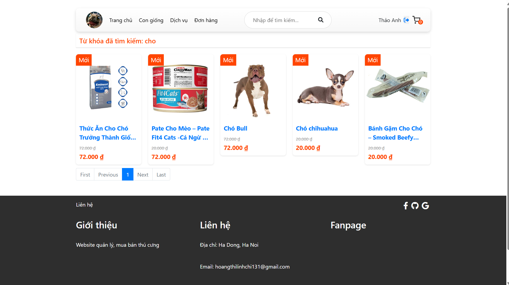

## About Shop Pet

Shop Pet is a pet store management website

Link demo: httpshttps//www.youtube.com/watch?v=xaKk8URDWW4

## Features

### User Functions
- Register and login
- Search, view products, and details
- Add to cart and checkout
- View order history and status
- Payment via COD and VNPAY

### Admin Functions
- Admin login
- Dashboard overview
- Manage orders, products, and categories
- CRUD operations (*add, edit, delete, search*)
- Revenue statistics

## Installation & Setup

Clone Repository:

    git clone https://github.com/lnhchi131/shop_pet.git
    cd shop_pet
    cd shopthucung_laravellaravel

Install Dependencies:

    composer install

Configure Environment:

    cp .env.example .env
    php artisan key:generate

Database Setup
Edit the .env file with database credentials and run:

    php artisan migrate --seed

Run the Server

    php artisan serve

Visit: 

    http://localhost:8000

## Functional Diagram

## Flowchart 

### Website screenshot

| Login  |  Home
|:-:|:-:|
|  |  |

| Product  |  Cart
|:-:|:-:|
|  |  |

| Orderss List  |  Filter
|:-:|:-:|
|  |  |

| Admin  |  Products  Management
|:-:|:-:|
|  |  |

| Categories  |  Order Management
|:-:|:-:|
|  |  |